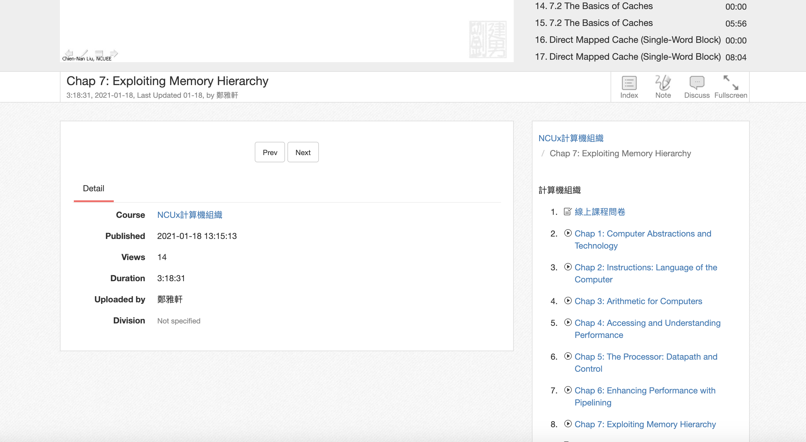
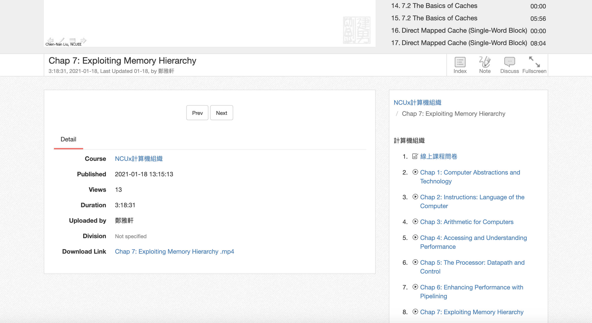
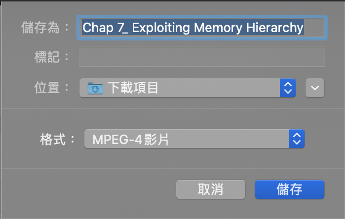

## eeclass video downloader

Lazy eeclass course video downloader.

Now (2021/06/10) status : Still Working!

### Intro

朋友的老師放在eeclass上的課程影片一陣子就會撤掉，但他想保存下來之後再看

於是我稍微研究了一下eeclass投放影片的機制，發現原理十分簡單，所以就順手寫下了這個工具

這個插件沒有任何技術含量，單純分享給像我一樣不想開devtool又不想寫code的懶人，為您節省幾秒鐘的時間~

### Demo

- Before

- After

### Usage For Chrome

1. Clone(Download) eeclass-video-dl-main.zip from github then unzip 

or use

	 git clone https://github.com/lebr0nli/eeclass-video-dl.git

2. Open **chrome://extensions** in a new tab.

3. Enable **Developer mode** at the top-right.

4. Click the **Load unpacked** button that just appeared.

5. Select the folder **eeclass-video-dl** in **eeclass-video-dl-main** (if you download by zip) or in **eeclass-video-dl** (if you clone by command line)

6. Enjoy!

### Warning

僅供教育學習使用，嚴禁商業用途，同時也請尊重著作權與肖像權，違者後果自負!

### Outro

Feel free to issue!
